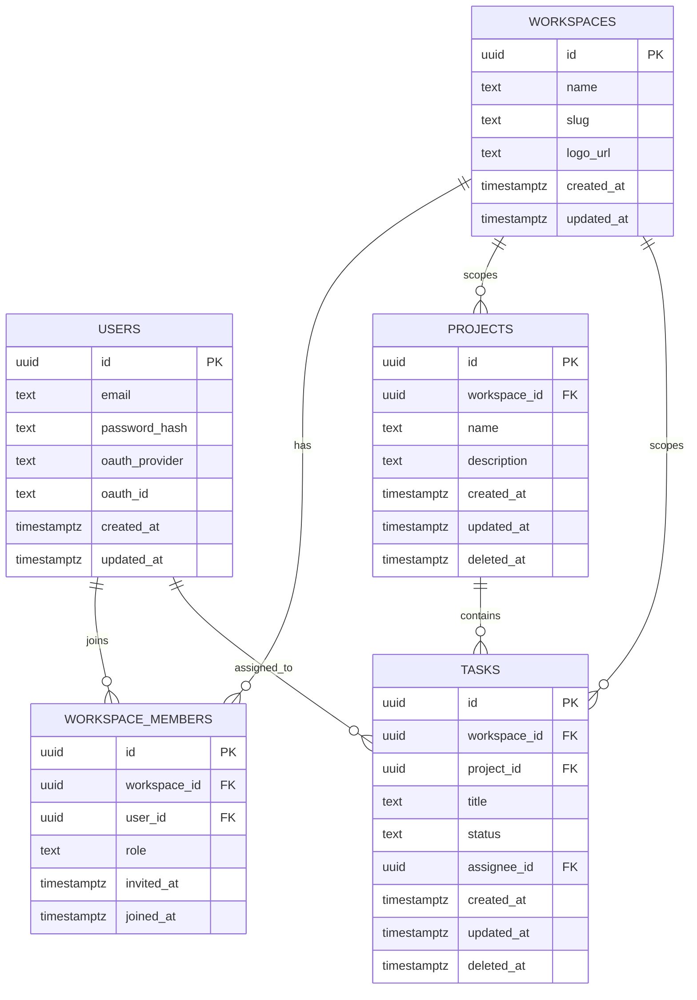
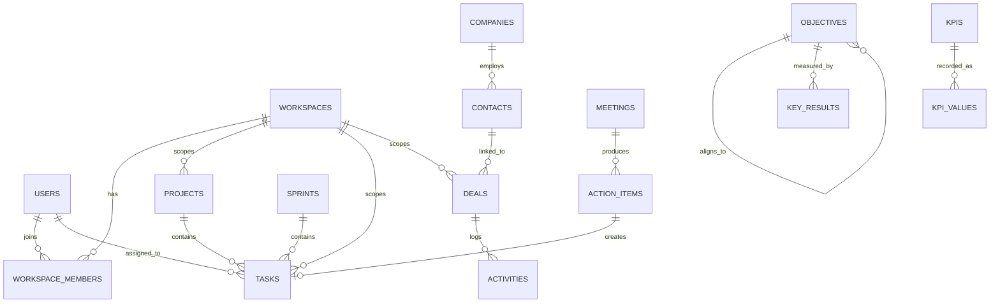

# Database

FoundryHQ uses PostgreSQL 16 via GORM. This document is split in two: **V1 Models**, the current design that the GORM models and migrations in `apps/api/` are built from, and **Planned Schema (v1.1+)**, forward-looking reference for modules not yet implemented (see `mvp.md` for what's in/out of v1). See `architecture.md` for how the repository layer enforces the boundaries described here in code.

## Conventions

- **Primary keys:** UUID (`gen_random_uuid()`), never auto-increment integers — avoids leaking record counts and simplifies merging data across environments.
- **Multi-tenancy:** every workspace-scoped table has a `workspace_id` (FK → `workspaces.id`), enforced at the repository layer, not the handler. `tasks` carries `workspace_id` directly even though it's reachable via `project_id → projects.workspace_id` — see the Tasks section below for why.
- **Timestamps:** every table has `created_at`, `updated_at`; soft-deletable tables also have `deleted_at` (GORM's soft-delete convention) — `projects` and `tasks` are soft-deleted; `workspace_members` (a join table) is hard-deleted, and `workspaces`/`users` have no soft-delete of their own (see Cascades below).
- **Foreign keys:** always indexed. `workspace_id` is indexed on every table that carries it — it's in the `WHERE` clause of nearly every query.

## V1 Models

The four entities needed for the v1 usable loop — auth, workspace/team, and shared tasks (see `mvp.md`) — plus the join table that realizes the Users↔Workspaces membership.

### Users

| Column | Type | Notes |
|---|---|---|
| id | uuid | PK |
| email | text | unique, not null |
| password_hash | text | nullable — null if OAuth-only |
| oauth_provider | text | nullable: `google`, `github` — column reserved now, OAuth login itself is deferred to v1.1+ per `mvp.md` |
| oauth_id | text | nullable |
| created_at / updated_at | timestamptz | |

**Relationships**
- Has many `workspace_members` — a user joins zero or more workspaces through this join table (many-to-many with `workspaces`).
- Has many `tasks` as assignee (`tasks.assignee_id`, nullable, `ON DELETE SET NULL` — unassigning a task should never delete it).
- Every user belongs to at least one workspace in practice; there's no account-only, workspace-less state (business rule, not FK-enforced — see `requirements.md`).

### Workspaces

| Column | Type | Notes |
|---|---|---|
| id | uuid | PK |
| name | text | not null |
| slug | text | unique, not null |
| logo_url | text | nullable |
| created_at / updated_at | timestamptz | |

**Relationships**
- Has many `workspace_members` — its team, each with a role (many-to-many with `users`).
- Has many `projects` (one-to-many).
- Has many `tasks` (one-to-many, denormalized — see Tasks below).
- Exactly one member has `role = 'owner'` at any time; ownership can transfer but is never left unassigned (business rule, enforced in the usecase layer, not a DB constraint).
- **Cascades:** workspaces are the one entity in this set that's genuinely hard-deleted (no `deleted_at`) — deletion is a deliberate, Owner-only action. `workspace_members.workspace_id`, `projects.workspace_id`, and `tasks.workspace_id` are all `ON DELETE CASCADE`, so deleting a workspace row removes its members, projects, and tasks in one statement, matching the cascade rule in `requirements.md`.

#### Supporting: Workspace Members

The join table realizing the Users↔Workspaces many-to-many, plus each member's role.

| Column | Type | Notes |
|---|---|---|
| id | uuid | PK |
| workspace_id | uuid | FK → `workspaces.id`, `ON DELETE CASCADE` |
| user_id | uuid | FK → `users.id` |
| role | text | v1 values: `owner`, `member`. `admin` and `viewer` are reserved in the schema (see the CHECK constraint) but not yet reachable from the UI — deferred to v1.1+ per `mvp.md` |
| invited_at | timestamptz | not null, defaults to `now()` |
| joined_at | timestamptz | nullable until the invite is accepted |

Unique constraint on `(workspace_id, user_id)` — a user can't join the same workspace twice.

### Projects

The organizational unit tasks live under — a workspace can have many projects, and every task belongs to exactly one (`requirements.md`'s business rule: "a task belongs to exactly one project within exactly one workspace").

| Column | Type | Notes |
|---|---|---|
| id | uuid | PK |
| workspace_id | uuid | FK → `workspaces.id`, `ON DELETE CASCADE`, not null |
| name | text | not null |
| description | text | nullable |
| created_at / updated_at / deleted_at | timestamptz | soft-deleted |

**Relationships**
- Belongs to one `workspace`.
- Has many `tasks`.
- **Cascades:** soft-deleting a project (the normal path — GORM sets `deleted_at`, no row is physically removed, so no DB-level cascade fires) should also soft-delete its tasks; enforced in the usecase layer. A genuine hard delete of a `projects` row (`tasks.project_id ON DELETE CASCADE`) only happens transitively, when its parent workspace is hard-deleted.

### Tasks

| Column | Type | Notes |
|---|---|---|
| id | uuid | PK |
| workspace_id | uuid | FK → `workspaces.id`, `ON DELETE CASCADE`, not null — denormalized from `project_id` (see below) |
| project_id | uuid | FK → `projects.id`, `ON DELETE CASCADE`, not null |
| title | text | not null |
| status | text | `todo`, `in_progress`, `done` — default `todo` |
| assignee_id | uuid | FK → `users.id`, nullable, `ON DELETE SET NULL` |
| created_at / updated_at / deleted_at | timestamptz | soft-deleted |

**Relationships**
- Belongs to one `project`.
- Belongs to one `workspace` — **denormalized**: `workspace_id` is always equal to the owning project's `workspace_id`. This is a deliberate trade-off, not an oversight — it keeps the "list tasks in workspace X" query (the most common one on the Kanban board) a single indexed lookup instead of a join through `projects`, and keeps workspace-scoping enforcement at the repository layer uniform across every table (see Conventions above). The invariant (`tasks.workspace_id == projects.workspace_id`) is enforced in the usecase layer when a task is created or its `project_id` changes — Postgres has no native way to cross-validate two FK columns without a trigger, and one isn't warranted for this.
- Optionally belongs to one `user` as assignee.

## Entity Relationship Diagram (V1)

## Planned Schema (v1.1+)

Not yet implemented — reference for modules deferred past v1 (see `mvp.md`). `tasks` itself also grows here: `sprint_id`, `priority`, `story_points`, and `due_date` are added to the existing table by a later migration, not a new one.

### `contacts` / `companies`
| Column | Type | Notes |
|---|---|---|
| id | uuid | PK |
| workspace_id | uuid | FK → workspaces |
| name | text | |
| email / phone | text | nullable, `contacts` only |
| company_id | uuid | FK → companies, nullable, `contacts` only |
| created_at / updated_at / deleted_at | timestamptz | |

### `deals`
| Column | Type | Notes |
|---|---|---|
| id | uuid | PK |
| workspace_id | uuid | FK → workspaces |
| name | text | |
| stage | text | `prospecting`, `qualified`, `proposal`, `negotiation`, `closed_won`, `closed_lost` |
| value_cents | bigint | stored as integer cents, never float |
| contact_id / company_id | uuid | FK, nullable |
| created_at / updated_at / deleted_at | timestamptz | |

### `activities`
| Column | Type | Notes |
|---|---|---|
| id | uuid | PK |
| workspace_id | uuid | FK → workspaces |
| deal_id / contact_id | uuid | FK, nullable — an activity attaches to one or both |
| type | text | `call`, `email`, `note`, `meeting` |
| body | text | |
| logged_by | uuid | FK → users |
| created_at | timestamptz | activities are immutable — no `updated_at` |

### `sprints` (+ new `tasks` columns)
| Column | Type | Notes |
|---|---|---|
| id | uuid | PK |
| workspace_id | uuid | FK → workspaces |
| name | text | |
| start_date / end_date | date | |
| created_at / updated_at | timestamptz | |

`tasks` gains: `sprint_id` (FK → sprints, nullable — null = backlog), `priority` (`urgent`, `high`, `medium`, `low`), `story_points` (int, nullable), `due_date` (date, nullable).

Velocity (sum of `story_points` for tasks with `status = 'done'` and `updated_at` within `[start_date, end_date]`) is computed at query time, not stored — see the rule in `../.ai/business-analysis/acceptance-criteria.md`.

### `meetings` / `action_items`
| Column | Type | Notes |
|---|---|---|
| id | uuid | PK |
| workspace_id | uuid | FK → workspaces |
| title | text | `meetings` only |
| notes | text | rich text, `meetings` only |
| meeting_id | uuid | FK → meetings, `action_items` only |
| linked_contact_id / linked_task_id | uuid | FK, nullable |
| assignee_id | uuid | FK → users, `action_items` only |
| due_date | date | nullable, `action_items` only |
| created_at / updated_at | timestamptz | |

An `action_item` is also inserted into `tasks` as a lightweight row at creation time, so it appears in the assignee's task list without a separate sync job.

### `objectives` / `key_results`
| Column | Type | Notes |
|---|---|---|
| id | uuid | PK |
| workspace_id | uuid | FK → workspaces |
| parent_objective_id | uuid | FK → objectives, nullable — builds the alignment tree |
| owner_type | text | `company`, `team`, `individual`, `objectives` only |
| title | text | `objectives` only |
| objective_id | uuid | FK → objectives, `key_results` only |
| metric_type | text | `numeric`, `percentage`, `boolean`, `key_results` only |
| target_value / current_value | numeric | `key_results` only |
| created_at / updated_at | timestamptz | |

### `kpis` / `kpi_values`
| Column | Type | Notes |
|---|---|---|
| id | uuid | PK |
| workspace_id | uuid | FK → workspaces |
| name | text | `kpis` only |
| target_type | text | `number`, `percent`, `currency`, `kpis` only |
| target_value | numeric | `kpis` only |
| kpi_id | uuid | FK → kpis, `kpi_values` only |
| value | numeric | `kpi_values` only |
| recorded_at | timestamptz | `kpi_values` only |

### `notifications`
| Column | Type | Notes |
|---|---|---|
| id | uuid | PK |
| workspace_id | uuid | FK → workspaces |
| user_id | uuid | FK → users — recipient |
| type | text | e.g. `mention`, `task_assigned`, `deal_stalled` |
| payload | jsonb | polymorphic reference to the source entity |
| read_at | timestamptz | nullable |
| created_at | timestamptz | |

### Full Vision Entity Relationship Diagram

V1 tables plus every planned addition above, for a holistic view.

## Migrations

Migrations live in `apps/api/internal/repositories/postgres/migrations/`, one file per change, applied in order. Every migration that isn't purely additive needs a documented rollback path — see the rollback rules in `../.ai/documentation/release.md`.
