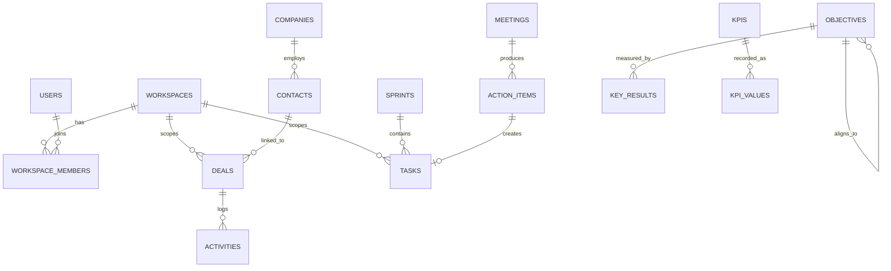

# Database

FoundryHQ uses PostgreSQL 16 via GORM. This is the reference schema for the current feature set — see `architecture.md` for how the repository layer enforces these boundaries in code.

## Conventions

- **Primary keys:** UUID (`gen_random_uuid()`), never auto-increment integers — avoids leaking record counts and simplifies merging data across environments.
- **Multi-tenancy:** every workspace-scoped table has a `workspace_id` (FK → `workspaces.id`), enforced at the repository layer, not the handler.
- **Timestamps:** every table has `created_at`, `updated_at`; soft-deletable tables also have `deleted_at` (GORM's soft-delete convention) — deals, tasks, contacts, and companies are soft-deleted; join/log tables (activities, notifications) are hard-deleted.
- **Foreign keys:** always indexed. `workspace_id` is indexed on every table that carries it — it's in the `WHERE` clause of nearly every query.

## Core Tables

### `workspaces`
| Column | Type | Notes |
|---|---|---|
| id | uuid | PK |
| name | text | |
| slug | text | unique |
| logo_url | text | nullable |
| created_at / updated_at | timestamptz | |

### `users`
| Column | Type | Notes |
|---|---|---|
| id | uuid | PK |
| email | text | unique |
| password_hash | text | nullable — null if OAuth-only |
| oauth_provider | text | nullable: `google`, `github` |
| oauth_id | text | nullable |
| created_at / updated_at | timestamptz | |

### `workspace_members`
| Column | Type | Notes |
|---|---|---|
| id | uuid | PK |
| workspace_id | uuid | FK → workspaces |
| user_id | uuid | FK → users |
| role | text | `owner`, `admin`, `member`, `viewer` |
| invited_at / joined_at | timestamptz | nullable joined_at until accepted |

Unique constraint on `(workspace_id, user_id)`.

### `contacts` / `companies`
| Column | Type | Notes |
|---|---|---|
| id | uuid | PK |
| workspace_id | uuid | FK → workspaces |
| name | text | |
| email / phone | text | nullable, `contacts` only |
| company_id | uuid | FK → companies, nullable, `contacts` only |
| created_at / updated_at / deleted_at | timestamptz | |

### `deals`
| Column | Type | Notes |
|---|---|---|
| id | uuid | PK |
| workspace_id | uuid | FK → workspaces |
| name | text | |
| stage | text | `prospecting`, `qualified`, `proposal`, `negotiation`, `closed_won`, `closed_lost` |
| value_cents | bigint | stored as integer cents, never float |
| contact_id / company_id | uuid | FK, nullable |
| created_at / updated_at / deleted_at | timestamptz | |

### `activities`
| Column | Type | Notes |
|---|---|---|
| id | uuid | PK |
| workspace_id | uuid | FK → workspaces |
| deal_id / contact_id | uuid | FK, nullable — an activity attaches to one or both |
| type | text | `call`, `email`, `note`, `meeting` |
| body | text | |
| logged_by | uuid | FK → users |
| created_at | timestamptz | activities are immutable — no `updated_at` |

### `tasks`
| Column | Type | Notes |
|---|---|---|
| id | uuid | PK |
| workspace_id | uuid | FK → workspaces |
| sprint_id | uuid | FK → sprints, nullable (null = backlog) |
| title | text | |
| status | text | `todo`, `in_progress`, `done` |
| priority | text | `urgent`, `high`, `medium`, `low` |
| story_points | int | nullable |
| assignee_id | uuid | FK → users, nullable |
| due_date | date | nullable |
| created_at / updated_at / deleted_at | timestamptz | |

### `sprints`
| Column | Type | Notes |
|---|---|---|
| id | uuid | PK |
| workspace_id | uuid | FK → workspaces |
| name | text | |
| start_date / end_date | date | |
| created_at / updated_at | timestamptz | |

Velocity (sum of `story_points` for tasks with `status = 'done'` and `updated_at` within `[start_date, end_date]`) is computed at query time, not stored — see the rule in `../.ai/business-analysis/acceptance-criteria.md`.

### `meetings` / `action_items`
| Column | Type | Notes |
|---|---|---|
| id | uuid | PK |
| workspace_id | uuid | FK → workspaces |
| title | text | `meetings` only |
| notes | text | rich text, `meetings` only |
| meeting_id | uuid | FK → meetings, `action_items` only |
| linked_contact_id / linked_task_id | uuid | FK, nullable |
| assignee_id | uuid | FK → users, `action_items` only |
| due_date | date | nullable, `action_items` only |
| created_at / updated_at | timestamptz | |

An `action_item` is also inserted into `tasks` as a lightweight row at creation time, so it appears in the assignee's task list without a separate sync job.

### `objectives` / `key_results`
| Column | Type | Notes |
|---|---|---|
| id | uuid | PK |
| workspace_id | uuid | FK → workspaces |
| parent_objective_id | uuid | FK → objectives, nullable — builds the alignment tree |
| owner_type | text | `company`, `team`, `individual`, `objectives` only |
| title | text | `objectives` only |
| objective_id | uuid | FK → objectives, `key_results` only |
| metric_type | text | `numeric`, `percentage`, `boolean`, `key_results` only |
| target_value / current_value | numeric | `key_results` only |
| created_at / updated_at | timestamptz | |

### `kpis` / `kpi_values`
| Column | Type | Notes |
|---|---|---|
| id | uuid | PK |
| workspace_id | uuid | FK → workspaces |
| name | text | `kpis` only |
| target_type | text | `number`, `percent`, `currency`, `kpis` only |
| target_value | numeric | `kpis` only |
| kpi_id | uuid | FK → kpis, `kpi_values` only |
| value | numeric | `kpi_values` only |
| recorded_at | timestamptz | `kpi_values` only |

### `notifications`
| Column | Type | Notes |
|---|---|---|
| id | uuid | PK |
| workspace_id | uuid | FK → workspaces |
| user_id | uuid | FK → users — recipient |
| type | text | e.g. `mention`, `task_assigned`, `deal_stalled` |
| payload | jsonb | polymorphic reference to the source entity |
| read_at | timestamptz | nullable |
| created_at | timestamptz | |

## Entity Relationships

## Migrations

Migrations live in `apps/api/internal/repositories/postgres/migrations/`, one file per change, applied in order. Every migration that isn't purely additive needs a documented rollback path — see the rollback rules in `../.ai/documentation/release.md`.
